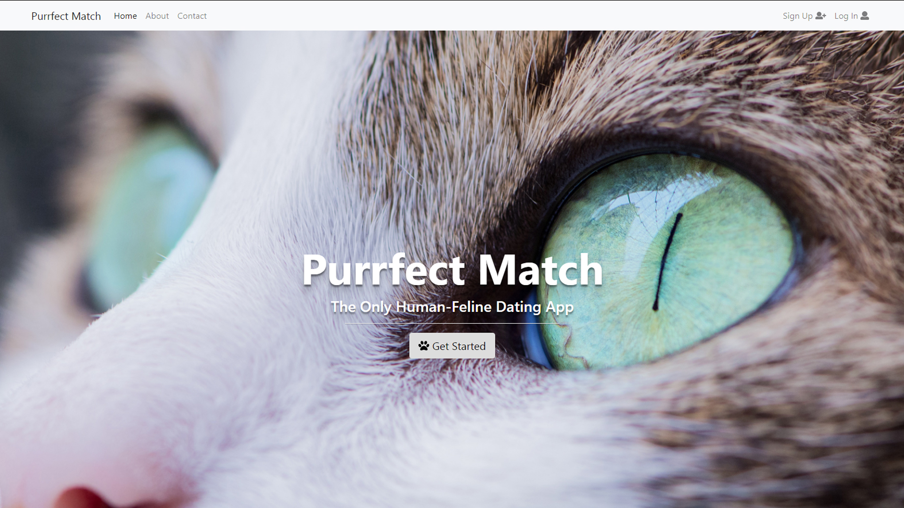
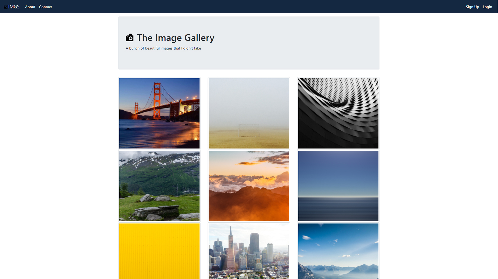
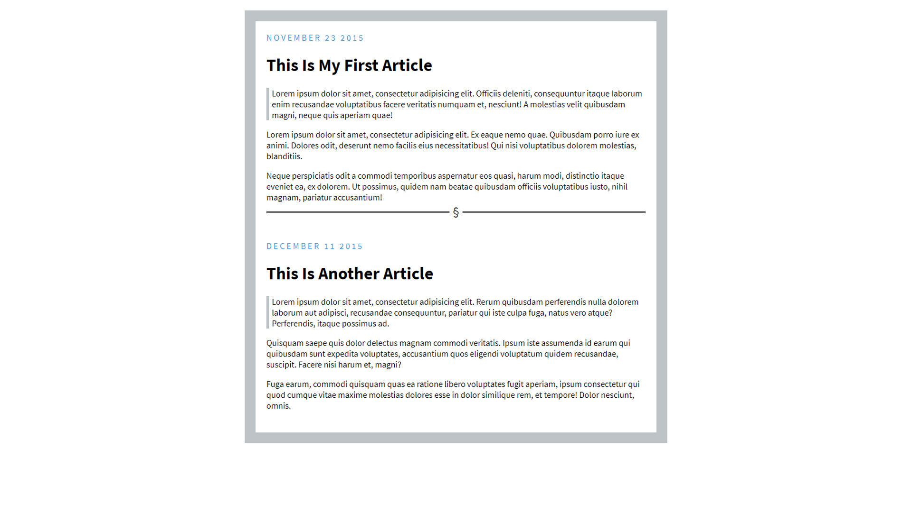

<!DOCTYPE html>
<html lang="en">
<head>

<!-- 	font awesome -->
	<link rel="stylesheet" href="https://use.fontawesome.com/releases/v5.0.10/css/all.css" integrity="sha384-+d0P83n9kaQMCwj8F4RJB66tzIwOKmrdb46+porD/OvrJ+37WqIM7UoBtwHO6Nlg" crossorigin="anonymous">
<!-- google font -->
	<link href="https://fonts.googleapis.com/css?family=Passion+One" rel="stylesheet">

	<!-- Bootstrap CSS -->
    <link rel="stylesheet" href="https://maxcdn.bootstrapcdn.com/bootstrap/4.0.0/css/bootstrap.min.css" integrity="sha384-Gn5384xqQ1aoWXA+058RXPxPg6fy4IWvTNh0E263XmFcJlSAwiGgFAW/dAiS6JXm" crossorigin="anonymous">

    <!-- Custom Style Sheet -->
    <link rel="stylesheet" href="index.css">

	<!-- Jquery, Popper.js, and Bootstrap JS -->
	
	
	

	<meta charset="UTF-8">
	<title>resume</title>

</head>
<body id="portfolio">

<!-- navbar -->
		<nav class="navbar navbar-expand-md navbar-dark bg-custom">
	  
		  <button class="navbar-toggler" type="button" data-toggle="collapse" data-target="#navbarNavDropdown" aria-controls="navbarNavDropdown" aria-expanded="false" aria-label="Toggle navigation">
		    
		  </button>
	  

	    <ul class="navbar-nav ml-auto">
	      <li class="nav-item">
	        <a class="nav-link" href="index.html">Home (current)</a>
	      </li>
	      <li class="nav-item">
	        <a class="nav-link" href="Portfolio.html">Portfolio</a>
	      </li>
	      <li class="nav-item active">
	        <a class="nav-link" href="Resume.html">Resume</a>
	      </li>
	      <li class="nav-item">
	      	<a class="nav-link" href="mailto:harrytalmeraz@gmail.com">
		      

		      	<i class="fas fa-envelope"></i>
		      
 
	  		</a> 
	  	  </li>	      
	  	  <li class="nav-item">
	      	<a class="nav-link" href="https://www.linkedin.com/in/harry-almeraz-6aba8a13a/">
		      

		      	<i class="fab fa-linkedin"></i>
		      
 
	  		</a> 
	  	  </li>
	  	  <li class="nav-item">
	      	<a class="nav-link" href="https://github.com/HarryBoBerry">
		      

		      	<i class="fab fa-github-square"></i>
		      
 
	  		</a> 
	  	  </li>
	    </ul>
	  

	</nav>

  

  

    

      <a href="port1.jpg">
        
        

          
Dating Site Template

        

      </a>
    

  

  

    

      <a href="port2.jpg">
        
        

          
Image Gallery Template

        

      </a>
    

  

  

    

      <a href="port3.jpg">
        
        

          
Blog Template

        

      </a>
    

  

</body>
</html>
